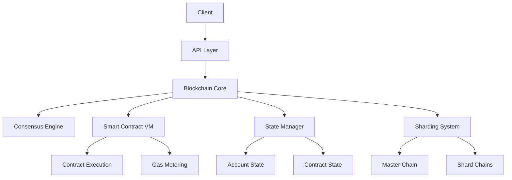

# Architecture Overview

## Core Components

### Blockchain Core
- **Block Structure**: Implements blocks with transactions, merkle root, and validator signatures
- **Transaction Processing**: Handles transaction validation, execution, and state updates
- **State Management**: Manages account balances, smart contract states, and validator information
- **Consensus**: Implements Proof of Stake consensus with validator selection and rewards

### Sharding System
- **Master Chain**: Coordinates shard chains and cross-shard communication
- **Shard Chains**: Process transactions within individual shards
- **Cross-Shard Communication**: Handles message passing and transaction verification between shards
- **State Synchronization**: Maintains consistency across shards

### Smart Contracts
- **Virtual Machine**: Executes smart contract code in a sandboxed environment
- **Contract State**: Manages contract storage and execution context
- **Gas Metering**: Tracks and limits computational resources
- **Contract Types**:
  - ERC20-like Token Contracts
  - ERC721 NFT Contracts
  - ERC1155 Multi-Token Contracts
  - Custom Contract Templates

### Validator System
- **Stake Management**: Handles validator stakes and delegations
- **Reputation Tracking**: Monitors validator performance and reliability
- **Reward Distribution**: Calculates and distributes block rewards
- **Slashing**: Penalizes malicious or unreliable validators

## System Architecture

## Data Flow

### Transaction Flow
1. Client submits transaction
2. Transaction validation
3. Shard assignment
4. Cross-shard verification (if needed)
5. Block inclusion
6. State update
7. Event emission

### Cross-Shard Communication
1. Source shard creates message
2. Master chain verifies message
3. Destination shard processes message
4. State synchronization
5. Message completion

### Smart Contract Execution
1. Contract deployment/call
2. Gas estimation
3. Code execution
4. State updates
5. Event logging

## Security Model

### Validator Security
- Stake-based participation
- Reputation system
- Slashing conditions
- Activity monitoring

### Transaction Security
- Digital signatures
- Nonce tracking
- Gas limits
- State validation

### Cross-Shard Security
- Merkle proofs
- Message verification
- State consistency checks
- Double-spend prevention

## Scalability Features

### Sharding
- Dynamic shard allocation
- Load balancing
- Cross-shard optimization
- State partitioning

### Performance
- Parallel transaction processing
- Optimized state access
- Efficient cross-shard communication
- Caching strategies

## Future Enhancements

### Planned Features
- Layer 2 scaling solutions
- Advanced smart contract features
- Enhanced security measures
- Improved cross-shard efficiency